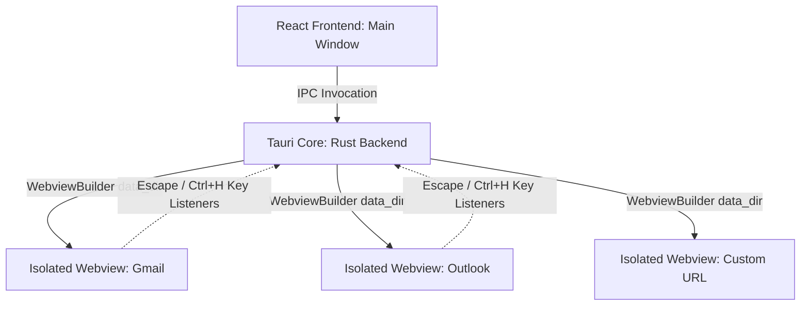

<div align="center">
  

  # Obsidian Mail
  


  ### *A Sleek, Multi-Session Desktop Email Launcher with True Session Isolation*

  [](https://tauri.app/)
  [](https://react.dev/)
  [](https://tailwindcss.com/)
  [](https://www.typescriptlang.org/)
  [](LICENSE)

  ---
</div>

**Obsidian Mail** is a premium desktop client designed for professionals managing multiple email accounts across Gmail, Outlook, iCloud, and custom services. Powered by **Tauri v2** and **React 19**, it attaches native webview containers directly inside a single-window layout to achieve absolute, hardware-level session and cookie isolation.

---

## ✨ Key Features

* 🔒 **True Cookie & Cache Isolation**  
  Each mailbox operates inside its own programmatically isolated system partition (`app_data_dir/sessions/account_[id]`). Log in to multiple work and personal accounts simultaneously without session pollution.
* 🖱️ **Minimalist Launcher Grid**  
  A clean dashboard showing all your mailboxes. Hover cards automatically highlight, and standard right-click triggers a custom context menu for full management.
* ⚡ **Shortcut-Driven Interface**  
  - Press `1` through `8` on the launcher to open the corresponding mailbox instantly.
  - Press `Escape` or `Ctrl + H` inside any active mailbox session to slide back home to the launcher dashboard.
* 🛠️ **Account Customization & Reordering**  
  Create custom mailboxes, edit names and service URLs, and rearrange the launcher order using simple click-and-drag-free buttons. Custom icons can be uploaded directly as Base64 Data URLs and saved in local storage.
* 🎨 **Obsidian Charcoal Theme**  
  An immersive dark layout tailored to obsidian aesthetics (`#0b0b0c`, `#111112`). Renders thin custom-themed scrollbars and micro-animations for high-end visual feedback.
* 📍 **Flat HUD Navigation Dock**  
  An auto-hiding dock at the bottom of the screen containing a home button and platform switchers, marked by a minimal horizontal glowing purple indicator underneath the active account.

---

## 🛠️ Architecture Overview



* **Frontend (React 19, Tailwind v4, Bun)**: Manages local accounts storage, launcher dashboard menus, custom Base64 icon uploads, coordinates dock events, and listens to keyboard shortcuts.
* **Backend (Tauri v2, Rust)**: Exposes Tauri IPC commands to programmatically spawn, hide, resize, or focus isolated borderless webview windows as child webviews of the main application. Injects keyboard listeners into third-party domains to bubble key commands out to the main container.

---

## 🚀 Getting Started

### Prerequisites
* [NodeJS](https://nodejs.org/) or [Bun](https://bun.sh/) (Recommended)
* [Rust Compiler & Cargo Toolchain](https://www.rust-lang.org/tools/install)
* Build tools for your OS (e.g., C++ Build Tools on Windows, Xcode Command Line Tools on macOS)

### Installation

1. **Clone the repository:**
   ```bash
   git clone https://github.com/yourusername/obsidian-mail.git
   cd obsidian-mail
   ```

2. **Install dependencies:**
   ```bash
   bun install
   ```

3. **Run the application in Development Mode:**
   ```bash
   bun tauri dev
   ```

4. **Package the Production Installer:**
   This generates ready-to-use `.msi` and `.exe` installer packages under `src-tauri/target/release/bundle/`:
   ```bash
   bun tauri build
   ```

---

## ⌨️ Shortcut Keys Cheatsheet

| Shortcut Key | Action | Location |
|---|---|---|
| `1` - `8` | Open mailbox profile at index | Launcher Dashboard |
| Right-click Card | Open context menu (Edit settings, Move, Delete) | Launcher Dashboard |
| `Escape` | Return to Launcher | Active Webview Session |
| `Ctrl + H` | Return to Launcher | Active Webview Session |

---

## 📜 License

Distributed under the MIT License. See [LICENSE](LICENSE) for more information.
